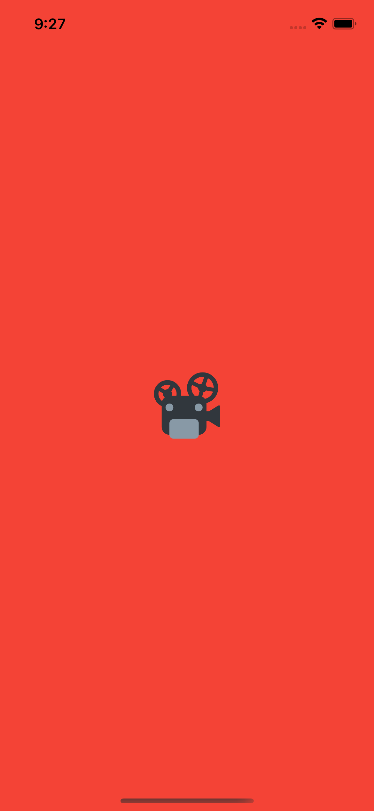
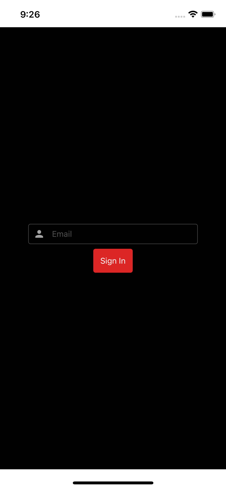
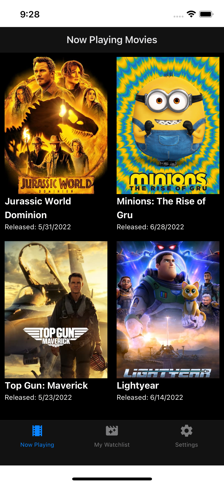
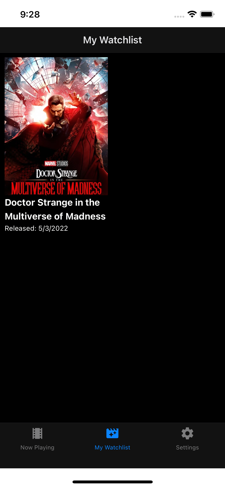
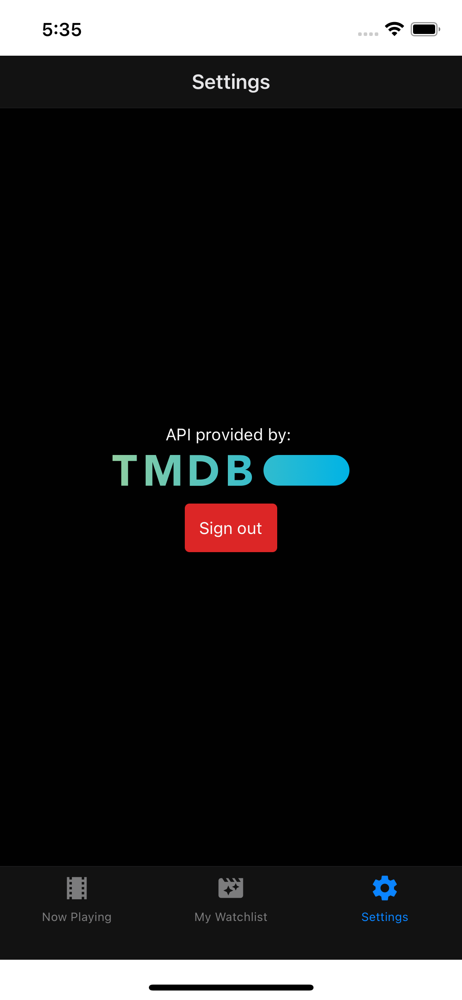

# tmdb-watchlist-edgedb

This app uses TMDB to retrieve a list of Now Playing movies.  You can add/remove movies to track which ones you've watched.  There's a "fake" auth flow as well to show navigation as well as tRPC middleware.

Simple app that showcases the following technology.

Expo + tRPC + EdgeDB + NextJS + Nx + zod + react-hook-form + solito

## Setup

Add your database and TMDB bearer token (instructions [here](https://www.themoviedb.org/documentation/api?language=en-US)) to the `.env` file.  If you aren't using Postgres, make the appropriate changes to the Prisma schema.

Install EdgeDB for your system - https://www.edgedb.com/install

Run `edgedb project init` in the root of the project to setup the existing schema in a new instance.

For a look at your database, install the RC preview of version 2!  https://www.edgedb.com/docs/changelog/2_x

Once that's done, run `edgedb ui` and check it out!

## Running the App

### Run the API

`nx serve next-app`

### Run the App

`nx run-ios mobile`

### Screenshots

